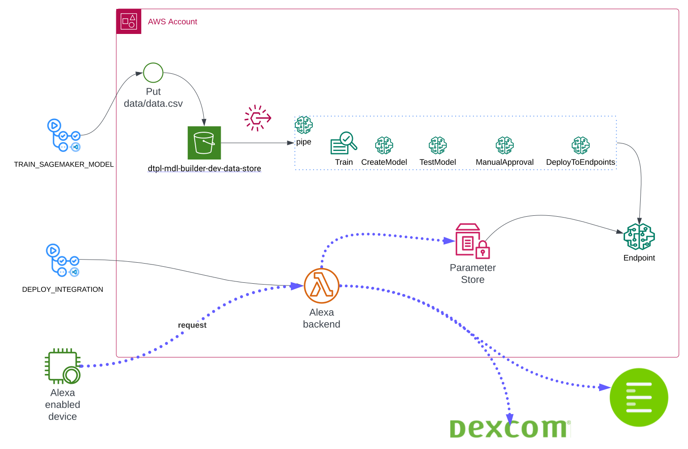

 
- 👀 Hey there, adventurer! Are you ready to embark on a thrilling journey into the world of AWS? Buckle up and get ready to explore the boundless possibilities and endless innovations that await you. And who better to guide you than the legendary Martin Nanchev - an AWS Community Builder, Authorized Instructor, and AWS Certified expert extraordinaire!

- 🌱 Martin's passion for all things AWS is truly contagious. He's not just a knowledgeable instructor, he's a dedicated mentor who is committed to sharing his expertise with others. Whether you're a beginner or an experienced pro, Martin will empower you with the latest techniques in AWS and Terraform, giving you the tools you need to take your projects to the next level.

- 💞️ But that's just the tip of the iceberg. Martin is always on the lookout for exciting collaboration opportunities, particularly in the realm of AWS Cloud migrations and architecting workloads. And with his keen eye for security, Martin is dedicated to improving security measures in the cloud to ensure the safety of all users. He's a true champion of AWS innovation and a trailblazer in the world of cloud computing.

- 📫 So if you're ready to join the ranks of those who have discovered the power of AWS with Martin's guidance, look no further. Drop him a line at ♠martin_nanchev@pokerstarsint.com♥ and get ready to unleash your full potential. Oh, and did we mention that Martin is also a fellow community builder with all 12 AWS Certifications under his belt? He's a force to be reckoned with, and he's ready to help you take on any IoT, mobile application, or telecommunications project that comes your way. Let's do this!

<!---
martinnanchev/martinnanchev is a ✨ special ✨ repository because its `README.md` (this file) appears on your GitHub profile.
You can click the Preview link to take a look at your changes.
--->
Diabetes Application to simulate blood sugar

