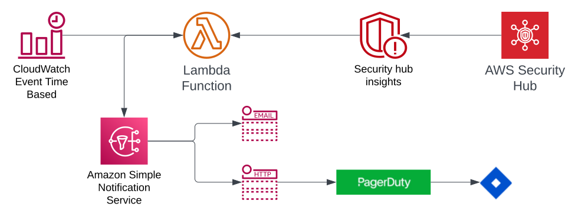

 
- 👋 Hi, I’m @martinnanchev
- 👀 I am a big AWS enthusiast and fanatic.
- 🌱 I’m currently teaching AWS and terraform other people
- 💞️ I’m looking to collaborate on AWS Cloud migrations and architecting workloads and improving security in the ⛅
- 📫 How to reach me -> ♠martin_nanchev@pokerstarsint.com♥

<!---
martinnanchev/martinnanchev is a ✨ special ✨ repository because its `README.md` (this file) appears on your GitHub profile.
You can click the Preview link to take a look at your changes.
--->
Security Hub Summarizer implementation:

